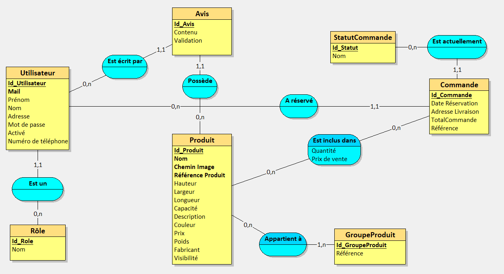

# MoneyBoxWebsite

## **Presentation**

### Technologies
Framework: **ASP.NET** with **Identity** framework and **Entity Framework Core** (EF).

Langage: **C#**, HTML5, CSS3.

This website is an **MVC** website application made as **CodeFirst** that uses some CRUD, a Repository Pattern and **Razor** for front-end.

Others: Miro, Github projects, Github issues.

### Subject
That project is based on a 2-weeks exercise where we were asked to realize a website around piggybank selling.

The **main tasks** that we had to do were :
- **Account**: Register, login, logout, profile.
- A **gallery of products** with their details, accessible for everyone.
- **Reviews**: being able to rate or add a comment to a product.
- **Shopping cart**: Add a product to the shopping cart with a certain quantity. Also being able to manage the shopping cart.
- **Order**: Once the shopping cart has been validated and purchased, users must be able to check their orders.

- **Roles and management**:
    * **5 roles**: Client, moderator, assistant, manager and admin
    * **Manage products**: enable or disable, create and edit.
    * **Manage orders**: Change the order status or notify a problem.
    * **Manage reviews**: Delete a review, accept or refuse a review.
    * **Manage users**: Change the roles, disable an account, modify user informations.

There is many other tasks that were asked but those are the main ones.

### Data model
Given the few time I was given, I decided to made a condensed MCD and used it to create my entities with EF and set-up my database.

## What's done

## To-do

## Advices that I got