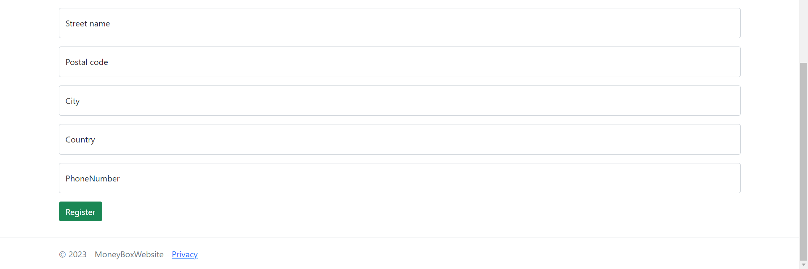

# MoneyBoxWebsite

## **Presentation**

### Technologies
Framework: **ASP.NET** with **Identity** framework and **Entity Framework Core** (EF).

Langage: **C#**, HTML5, CSS3.

This website is an **MVC** website application made as **CodeFirst** that uses some CRUD, a Repository Pattern and **Razor** for front-end.

Others: Miro, Github projects, Github issues.

### Subject
That project is based on a 2-weeks exercise where we were asked to realize a website around piggybank selling.

The **main tasks** that we had to do were :
- **Account**: Register, login, logout, profile.
- A **gallery of products** with their details, accessible for everyone.
- **Reviews**: being able to rate or add a comment to a product.
- **Shopping cart**: Add a product to the shopping cart with a certain quantity. Also being able to manage the shopping cart.
- **Order**: Once the shopping cart has been validated and purchased, users must be able to check their orders.

- **Roles and management**:
    * **5 roles**: Client, moderator, assistant, manager and admin
    * **Manage products**: enable or disable, create and edit.
    * **Manage orders**: Change the order status or notify a problem.
    * **Manage reviews**: Delete a review, accept or refuse a review.
    * **Manage users**: Change the roles, disable an account, modify user informations.

There is many other tasks that were asked but those are the main ones.

### Data model
Given the few time I was given, I decided to made a condensed MCD and used it to create my entities with EF and set-up my database.

## What's done

Quickly, there currently are:
- **A register, login and logout** system. 
*See [Account](#account) for more details.*
- A **role management system** that allows to add roles to users. Each roles has defined access and restrictions. 
*See [Role Manager](#role-manager) for more details.*
- A **product manager** that allows to add, edit, delete and show all the products. Some products may be disabled and basic users cannot see them, instead of some other roles. Products can be linked with "product groups" that can be used to sort or show similar products or colors. 
*See [Product Manager](#product-manager) for more details.*
- The shopping cart is an on-going feature.

### Account

When creating an account, many checks are done in order to avoid duplicate username and email. I also used many regular expressions and Data Annotations to avoid receiving invalid entries.

 

When the user sign in, he can also check the "Stay signed in" box to create a cookie that allows to stay connected even when closing the web browser.

### Role Manager
As said before, there are five roles: Client, moderator, assistant, manager and admin. Each one can do different tasks and access content or be restricted on some others. *See [Subject](#subject) for more details.*

### Product Manager

## To-do

## Advices that I got